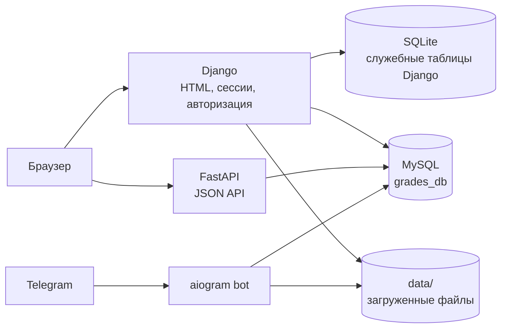

# Web Rating

**Web Rating** — учебная информационная система для расчёта и просмотра рейтинга студентов. Рейтинг объединяет академические оценки, данные деканата и подтверждённые внеучебные достижения.

Проект состоит из веб-приложения на Django, API на FastAPI, базы MySQL и Telegram-бота на aiogram.

> Статус: активная разработка. Проект подходит для локальной демонстрации и учебного портфолио. Перед публичным деплоем необходимо выполнить пункты из раздела [Подготовка к продакшену](#подготовка-к-продакшену).

## Возможности

### Студент

- вход в систему по логину и паролю;
- просмотр рейтинга своей учебной группы;
- просмотр личного профиля;
- просмотр баллов по четырём направлениям активности;
- просмотр собственных достижений и статуса модерации;
- отправка нового достижения через сайт;
- прикрепление подтверждающего файла;
- выбор одного из нескольких привязанных Telegram-аккаунтов;
- отправка достижения через Telegram-бота.

### Администратор

- просмотр количества заявок, ожидающих проверки;
- просмотр рейтинга отдельной группы;
- просмотр общего рейтинга по всем группам;
- сортировка рейтинговой таблицы по столбцам;
- изменение весов категорий достижений;
- модерация достижений через Telegram-бота;
- назначение категории и балла;
- подтверждение или отклонение заявки;
- блокировка Telegram-аккаунта.

## Категории активности

В системе используются четыре категории:

1. учебная активность;
2. научная активность;
3. социальная активность;
4. культурно-досуговая активность.

В итоговый рейтинг входят:

- оценки из академической системы;
- оценки деканата;
- подтверждённые достижения со статусом `approve`;
- вес учебной дисциплины;
- настраиваемый вес категории достижения.

## Как считается рейтинг

Для академических оценок и оценок деканата вычисляются два значения:

```text
обычный балл = сумма оценок
взвешенный балл = сумма(оценка × вес дисциплины)
```

Для подтверждённых достижений:

```text
обычный балл достижения = grade
взвешенный балл достижения = grade × вес категории
```

Общий рейтинг — сумма баллов всех направлений. В рейтинг включаются только одобренные достижения.

## Архитектура



### Компоненты

| Компонент | Назначение |
|---|---|
| Django | HTML-страницы, сессии, авторизация, загрузка файлов, административный интерфейс |
| FastAPI | Получение рейтинга и пользовательских данных, добавление веб-достижений |
| SQLAlchemy Async | Асинхронная работа FastAPI с MySQL |
| Django ORM | Работа админской страницы с таблицами MySQL |
| MySQL | Пользователи, группы, оценки, категории, Telegram-аккаунты и достижения |
| SQLite | Служебные данные Django в локальной конфигурации |
| aiogram | Telegram-бот и сценарий модерации достижений |
| JavaScript | Загрузка данных из API без перезагрузки страницы |
| Bootstrap | Адаптивная вёрстка, формы и таблицы |

## Структура проекта

```text
Web_Rating/
├── rating_site/
│   ├── backend/
│   │   ├── db_conn.py              # Async SQLAlchemy engine и создание таблиц
│   │   ├── db_create.py            # Создание MySQL-базы
│   │   ├── db_models.py            # SQLAlchemy-модели
│   │   ├── db_get_requests.py      # Чтение данных и расчёт рейтинга
│   │   ├── db_post_requests.py     # Добавление данных
│   │   ├── maps.py                 # Карта алиасов категорий
│   │   ├── schems.py               # Pydantic-схемы
│   │   └── server.py               # FastAPI-приложение
│   ├── rating/
│   │   ├── templates/              # Django-шаблоны
│   │   ├── backends.py             # Пользовательский backend авторизации
│   │   ├── context_processors.py   # API_BASE_URL для шаблонов
│   │   ├── decorators.py           # Проверка прав администратора
│   │   ├── models.py               # CustomUser для существующей MySQL-таблицы
│   │   ├── mysql_models.py         # unmanaged-модели MySQL
│   │   ├── urls.py                 # URL приложения
│   │   └── views.py                # Django views
│   ├── rating_site/
│   │   ├── urls.py
│   │   ├── asgi.py
│   │   └── wsgi.py
│   ├── static/
│   │   ├── css/
│   │   │   ├── add_achievement.css
│   │   │   ├── admin_interface.css
│   │   │   └── main.css
│   │   ├── img/
│   │   └── js/
│   │       ├── add_achievement.js
│   │       ├── admin_interface.js
│   │       ├── get_admin_users_rating_by_group.js
│   │       ├── get_all_groups.js
│   │       └── ...
│   ├── tg_bot/
│   │   ├── admin.py                # Модерация заявок
│   │   ├── bot.py                  # Пользовательские сценарии
│   │   ├── db_connection.py        # mysql.connector
│   │   ├── keyboards.py
│   │   ├── sql_get_func.py
│   │   └── sql_post_func.py
│   ├── env_loader.py               # Чтение rating_site/.env
│   ├── manage.py
│   └── settings.py
├── data/                           # Загруженные файлы, не хранить в Git
├── requirements.txt
└── README.md
```

## Требования

- Python 3.12 или новее;
- MySQL 8;
- Telegram-бот, созданный через BotFather;
- при текущей конфигурации бота — рабочий SOCKS5-прокси;
- Windows, Linux или macOS.

## Установка

Все команды ниже выполняются из корня `Web_Rating`.

### 1. Создать виртуальное окружение

#### Windows PowerShell

```powershell
py -m venv .venv
.venv\Scripts\Activate.ps1
python -m pip install --upgrade pip
```

#### Windows cmd

```bat
py -m venv .venv
.venv\Scripts\activate.bat
python -m pip install --upgrade pip
```

#### Linux/macOS

```bash
python3 -m venv .venv
source .venv/bin/activate
python -m pip install --upgrade pip
```

### 2. Установить зависимости

```bash
pip install -r requirements.txt
```

## Настройка окружения

Скопируйте пример конфигурации:

#### Windows

```powershell
Copy-Item rating_site\.env.example rating_site\.env
```

#### Linux/macOS

```bash
cp rating_site/.env.example rating_site/.env
```

Заполните `rating_site/.env`:

```env
BOT_TOKEN=replace-with-bot-token
ADMIN_ID=123456789

DB_HOSTNAME=127.0.0.1
DB_PORT=3306
DB_USERNAME=rating_user
DB_PASSWORD=replace-with-db-password
DB_NAME=grades_db

SECRET_KEY=replace-with-long-random-django-secret
API_BASE_URL=http://127.0.0.1:8000
PROXY_URL=socks5://127.0.0.1:10808
```

Сгенерировать Django `SECRET_KEY` можно командой:

```bash
python -c "from django.core.management.utils import get_random_secret_key; print(get_random_secret_key())"
```

> `rating_site/.env` содержит секреты. Не добавляйте его в Git и не включайте в архив для публикации.

## Инициализация базы

### 1. Создать MySQL-базу и таблицы SQLAlchemy

```bash
py -m rating_site.backend.db_conn
```

Команда создаёт базу и таблицы, если они отсутствуют.

### 2. Создать служебные таблицы Django

```bash
py -m rating_site.manage migrate
```

### 3. Выполнить

```sql
USE grades_db;

INSERT INTO study_groups
VALUES
(1, 'М3О-337Б-23'),
(2, 'М3О-334Б-23'),
(3, 'М3О-336Б-23');

INSERT INTO users
VALUES
(1, "Andrey", "student13", "Testik=56", 2, False, True, 1774869837),
(2, "Ilya", "student14", "Testik=56", 2, True, False, 1774869899),
(3, "Yana", "yanchik", "Test", 2, True, False, 1774869945),
(4, "Georgiy", "gus2", "R3", 3, False, False, 1774870435);

INSERT INTO courses
VALUES
(1, 1, "Artem_Nicolaevich", "Virtual'naya_real'nost", 9, 1774870469),
(2, 2, "Ylia_Vyacheslavovna", "Marketing", 6, 1774870569),
(3, 4, "Svetlana_Sergeevna", "Genial'nost", 10, 1774870871);

INSERT INTO academy_grades
VALUES
(1, 4, 3, 4.5, 1774869843);

INSERT INTO category_data
VALUES
(1, 'Учебная активность', 'study_activity', 3),
(2, 'Научная активность', 'scienece_activity', 5),
(3, 'Социальная активность', 'social_activity', 10),
(4, 'Культурно досуговая активность', 'culture_activity', 6);
```

Также для полноценной работы потребуются зарегистрироваться в боте, после заполнения таблиц:


## Запуск

Проект состоит из трёх процессов. Удобнее открыть три терминала.

### FastAPI

```bash
py -m uvicorn rating_site.backend.server:app --reload --host 127.0.0.1 --port 8000
```

Документация API:

```text
http://127.0.0.1:8000/docs
```

### Django

```bash
py -m rating_site.manage runserver 8001
```

Сайт:

```text
http://127.0.0.1:8001/
```

### Telegram-бот

```bash
py -m rating_site.tg_bot.bot
```

## Основные страницы

| URL | Назначение |
|---|---|
| `/` | Главная страница |
| `/accounts/login/` | Авторизация |
| `/profile/` | Профиль пользователя и рейтинг группы |
| `/my_achievements/` | Личные баллы и достижения |
| `/add_achievement/` | Добавление достижения |
| `/admin_interface/` | Административный интерфейс |

## API

| Метод | Endpoint | Назначение |
|---|---|---|
| GET | `/get_api_user_data/{login}` | Данные пользователя |
| GET | `/get_api_users_rating_by_group/{group_id}` | Рейтинг одной группы |
| GET | `/get_api_users_rating_by_group/all` | Рейтинг всех групп |
| GET | `/get_api_user_achievements_by_login/{login}` | Достижения пользователя |
| GET | `/get_api_users_activity_info_by_login/{login}` | Баллы по направлениям |
| GET | `/get_api_users_tg_accounts_by_login/{login}` | Привязанные Telegram-аккаунты |
| GET | `/get_api_all_groups` | Список групп |
| POST | `/post_api_add_web_achievement` | Добавление достижения с сайта |

Пример ответа рейтинга:

```json
{
  "users": [
    {
      "id": 1,
      "user_name": "Иван Иванов",
      "grade_group_by_activity": {
        "study_activity": 25,
        "science_activity": 5,
        "social_activity": 3,
        "culture_activity": 2,
        "general_rating": 35
      },
      "weighted_grade_group_by_activity": {
        "study_activity": 90,
        "science_activity": 50,
        "social_activity": 30,
        "culture_activity": 20,
        "general_weighted_rating": 190
      }
    }
  ]
}
```

## Настройка API_BASE_URL

Django передаёт значение `API_BASE_URL` из `.env` в шаблоны через context processor:

```text
.env → settings.API_BASE_URL → context processor → window.API_BASE_URL → JS
```

Локально:

```env
API_BASE_URL=http://127.0.0.1:8000
```

После деплоя с отдельным доменом API:

```env
API_BASE_URL=https://api.example.com
```

При использовании Nginx на одном домене:

```env
API_BASE_URL=/api
```

После изменения `.env` перезапустите Django.

## Работа с файлами

Загруженные файлы сохраняются в каталог:

```text
data/
```

В базе рекомендуется хранить только относительный путь:

```text
data/<uuid>.<extension>
```

Каталог `data/` не должен попадать в Git. Для продакшена лучше использовать отдельное файловое хранилище или объектное хранилище.

## Текущие ограничения

- пользовательские пароли в текущей реализации сравниваются как обычный текст;
- личные FastAPI-endpoint'ы не защищены отдельной API-авторизацией;
- Telegram-привязка основана на логине пользователя и Telegram username;
- бот выполняет синхронные MySQL-запросы внутри асинхронных обработчиков;
- Django, FastAPI и бот содержат несколько описаний одной схемы MySQL;
- отсутствуют автоматические тесты расчёта рейтинга;
- схема MySQL создаётся через `create_all`, без Alembic-миграций;
- текущий `Makefile` содержит локальные Windows-пути и не является переносимым.

## Подготовка к продакшену

Перед публичным размещением необходимо:

1. перевести пароли на безопасные хеши Django;
2. удалить реальные `.env`, пользовательские файлы, SQLite и `.git` из публикуемых архивов;
3. отозвать токены, которые когда-либо попадали в Git или передавались в архиве;
4. установить `DEBUG=False`;
5. заполнить `ALLOWED_HOSTS`;
6. перенести настройки MySQL целиком в переменные окружения;
7. ограничить CORS боевым доменом;
8. закрыть личные API-endpoint'ы авторизацией;
9. валидировать размер, расширение и MIME-тип загружаемых файлов;
10. настроить HTTPS и reverse proxy;
11. добавить тесты;
12. заменить `print()` на стандартный `logging`;
13. добавить миграции MySQL;
14. настроить резервное копирование базы и файлов.

## Рекомендуемые тесты

### Рейтинг

- пользователь без оценок и достижений;
- академические оценки с разными весами дисциплин;
- оценки деканата;
- достижения каждой категории;
- несколько Telegram-аккаунтов у одного пользователя;
- статус `viewing` не учитывается;
- статус `deny` не учитывается;
- статус `approve` учитывается;
- изменение веса категории меняет итоговый рейтинг;
- рейтинг конкретной группы;
- рейтинг всех групп;
- неизвестная категория не попадает в культурную автоматически.

### Django

- неавторизованный пользователь не может сохранить веса;
- обычный пользователь получает 403;
- администратор может сохранить веса;
- отрицательный или некорректный вес возвращает 400;
- форма отклоняет отсутствующий файл;
- Telegram-аккаунт проверяется на принадлежность текущему пользователю.

## Рекомендации по Git

В репозиторий не должны попадать:

```gitignore
.env
.env.*
!.env.example

.idea/
__pycache__/
*.py[cod]
*.sqlite3
data/
media/
.pytest_cache/
.coverage
htmlcov/
```

Перед отправкой проекта архивируйте только рабочие исходники. Не включайте `.git`, `.env`, `data`, `db.sqlite3`, `.idea` и `__pycache__`.

## Планы развития

- безопасная авторизация и хранение паролей;
- одноразовый код для Telegram-привязки;
- веб-модерация заявок;
- отдельный сервис расчёта рейтинга;
- пагинация и серверная сортировка;
- экспорт рейтинга в CSV/XLSX;
- журнал действий администратора;
- уведомление пользователя о результате модерации;
- Docker Compose для Django, FastAPI, MySQL и бота;
- CI с линтерами и тестами.

## Лицензия

Учебный проект. Перед публикацией добавьте выбранную лицензию, например MIT.
